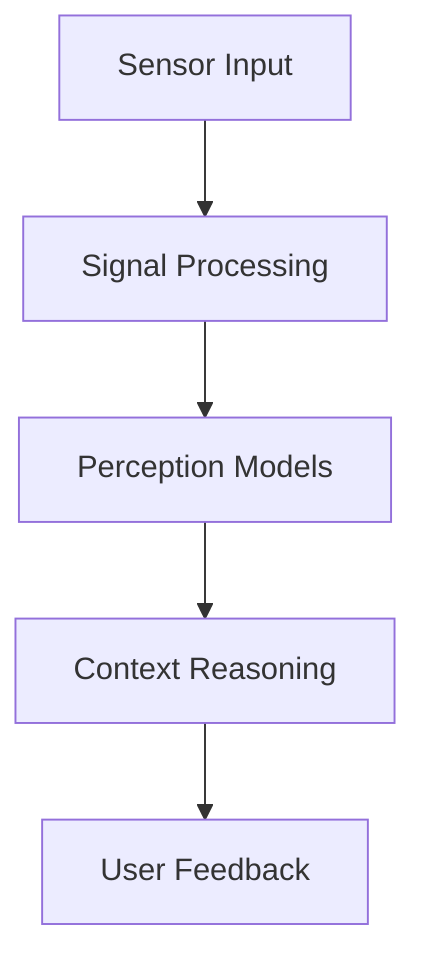
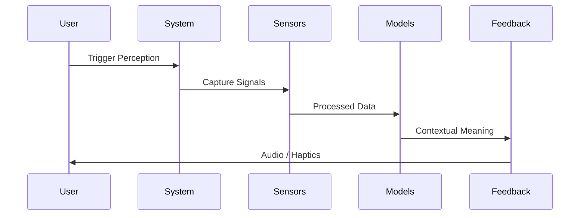
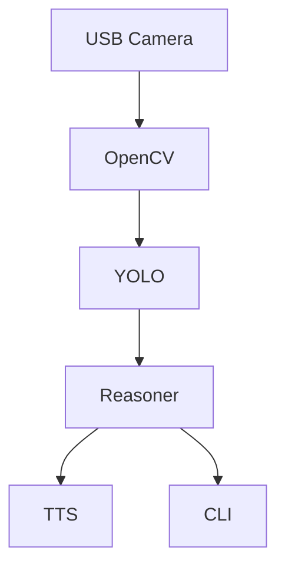
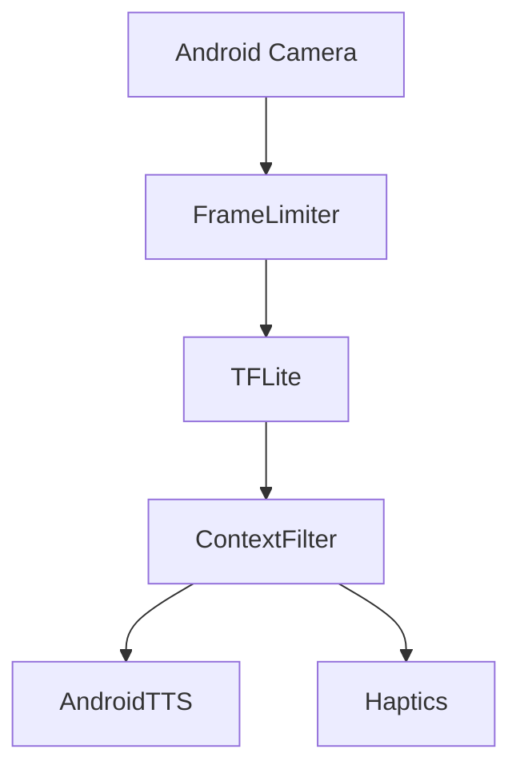
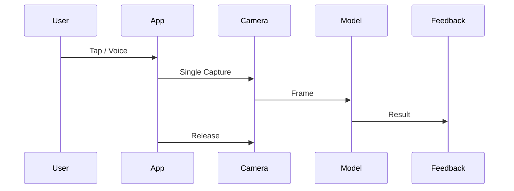
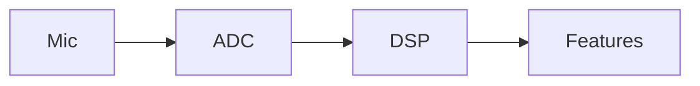
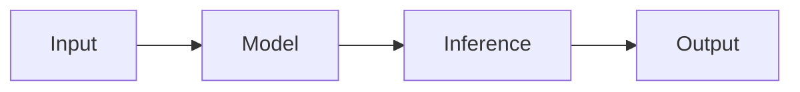
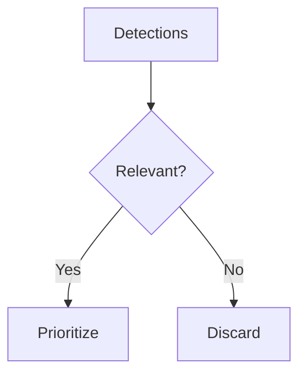
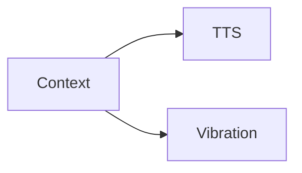

# VisionX

> Voice-activated object detection for the visually impaired.

---

## 1. Project Overview

**VisionX** is an assistive perception system designed to help visually impaired users understand their surroundings through structured sensory processing and calm feedback.

VisionX is not a single application. It is a **perception philosophy** implemented across multiple platforms (Desktop, Mobile, and future embedded systems), each respecting its own physical and system constraints.

**Core Promise:**

* Local-first (privacy-preserving)
* Deterministic and explainable flow
* Human-centered feedback

---

## 2. The Core Idea

```
World → Sensors → Signals → Meaning → Feedback
```

VisionX transforms raw physical signals (light, sound, vibration) into contextual meaning and communicates that meaning back to the user in the least cognitively demanding way possible.

---

## 3. Design Philosophy

### 3.1 Local-First

All perception and reasoning happen on-device. No cloud inference, no hidden data transfer.

### 3.2 Clarity Over Cleverness

The system prioritizes understandable pipelines over opaque abstractions.

### 3.3 Assistive-Centered Design

Latency, predictability, and calm output matter more than raw accuracy.

### 3.4 Learnable System

VisionX is meant to be read, understood, and extended.

---

## 4. Shared Conceptual Architecture

This architecture represents the **idea**, not the repository layout.



---

## 5. Execution Flow (Conceptual)



---

## 6. VisionX Variants

VisionX exists as multiple **variants**, each adapting the same conceptual pipeline to different constraints.

### 6.1 Variant Overview

| Variant | Platform        | Constraints        | Interaction      |
| ------- | --------------- | ------------------ | ---------------- |
| Desktop | Linux / Windows | Power-rich, static | Keyboard / Voice |
| Mobile  | Android         | Battery, thermal   | Touch / Voice    |
| Future  | Wearables       | Ultra-low power    | Audio / Haptics  |

---

## 7. Variant Architectures

### 7.1 Desktop Architecture



**Characteristics:**

* Continuous capture
* Long-running processes
* Higher memory budget

---

### 7.2 Mobile Architecture



**Characteristics:**

* On-demand execution
* Battery-aware processing
* Aggressive resource cleanup

---

## 8. Execution Flow per Variant

### 8.1 Desktop Flow

```mermaid
graph TD
    Start([App Starts]) --> Init[Initialize VisionX App]
    Init --> LoadConfig[Load Config<br/>Camera ID, YOLO Model, etc.]
    LoadConfig --> CreateSupervisor[Create VisionSupervisor]
    
    CreateSupervisor --> InitServices[Initialize Services]
    InitServices --> InitCamera[Camera Service<br/>OpenCVCamera]
    InitServices --> InitYOLO[Vision Service<br/>YOLOVisionService]
    InitServices --> InitTTS[Audio Service<br/>Pyttsx3TTS]
    InitServices --> InitVosk[Speech Recognition<br/>VoskSpeechRecognition]
    
    InitCamera --> WarmUp[Warm Up YOLO Model]
    InitYOLO --> WarmUp
    InitTTS --> WarmUp
    InitVosk --> WarmUp
    
    WarmUp --> TTSReady[TTS: 'Ready, Say start']
    TTSReady --> StartListening[Start Voice Recognition Thread]
    
    StartListening --> ListenLoop{Listening for<br/>Trigger Words}
    
    ListenLoop -->|Microphone Input| VoskProcessing[Vosk Processes Audio]
    VoskProcessing --> RecognizeText{Text Recognized?}
    
    RecognizeText -->|No| ListenLoop
    RecognizeText -->|Yes| CheckTrigger{Contains Trigger Word?<br/>start, detect, see, look}
    
    CheckTrigger -->|No| ListenLoop
    CheckTrigger -->|Yes| CheckCooldown{Cooldown Active?<br/>3 seconds}
    
    CheckCooldown -->|Yes| ListenLoop
    CheckCooldown -->|No| VoiceCommand[Voice Command Detected]
    
    VoiceCommand --> UpdateCooldown[Update Last Detection Time]
    UpdateCooldown --> StartDetection[Start Detection Thread]
    
    StartDetection --> TTSDetecting[TTS: 'Detecting']
    TTSDetecting --> OpenCamera[Open Camera]
    OpenCamera --> CaptureFrame[Capture Single Frame]
    
    CaptureFrame --> YOLOProcess[YOLO Processes Frame]
    YOLOProcess --> DetectObjects[Detect Objects<br/>Confidence > 0.5]
    
    DetectObjects --> CreateDetections[Create Detection Objects<br/>class_name, confidence, bbox]
    CreateDetections --> GroupObjects[Group by Class Name<br/>Count Objects]
    
    GroupObjects --> GenerateDesc[Generate Natural Language<br/>Description UseCase]
    
    GenerateDesc --> CheckCount{How Many Objects?}
    CheckCount -->|0| NoObjects[Description: 'I don't see<br/>anything clearly']
    CheckCount -->|1| SingleObject[Description: 'I see a person']
    CheckCount -->|2| TwoObjects[Description: 'I see a person<br/>and a laptop']
    CheckCount -->|3+| MultiObjects[Description: 'I see a person,<br/>a laptop, and 2 cups']
    
    NoObjects --> Speak[TTS Speaks Description]
    SingleObject --> Speak
    TwoObjects --> Speak
    MultiObjects --> Speak
    
    Speak --> ReleaseCamera[Release Camera]
    ReleaseCamera --> UpdateUI[Update UI Status]
    UpdateUI --> BackToListening[Back to Listening Mode]
    
    BackToListening --> ListenLoop
    
    style Start fill:#4CAF50
    style ListenLoop fill:#2196F3
    style VoiceCommand fill:#FF9800
    style YOLOProcess fill:#9C27B0
    style Speak fill:#F44336
    style BackToListening fill:#4CAF50
```



### 8.2 Mobile Flow



---

## 9. Subsystem Breakdown

### 9.1 Signal Layer



Handles analog-to-digital conversion, windowing, and feature extraction.

---

### 9.2 Perception Layer



Includes vision models (YOLO/TFLite) and speech recognition.

---

### 9.3 Reasoning Layer



Responsible for filtering, prioritization, and narrative construction.

---

### 9.4 Feedback Layer



Converts meaning into calm, understandable feedback.

---

## 10. Repository Structures

### 10.1 Desktop - Core

```
visionx/
├─ app/                     # UI entry point
│  └─ main.py              # KivyMD application
├─ orchestrator/            # Main coordination logic
│  └─ supervisor.py        # Orchestrates all services
├─ domain/                  # Business logic
│  ├─ entities.py          # Data models
│  └─ usecases.py          # Use cases
├─ services/                # External service wrappers
│  ├─ camera.py            # Camera interface
│  ├─ vision.py            # YOLO wrapper
│  ├─ audio.py             # Text-to-speech
│  └─ speech_recognition.py # Vosk wrapper
├─ infra/                   # Infrastructure
│  └─ config.py            # Configuration
└─ requirements.txt
```

### 10.2 Mobile

```
visionx-mobile/
├── app/
├── system/
├── perception/
└── ui/
```

> Structural differences reflect platform constraints, not conceptual divergence.

---

## 11. Contribution Guide

### 11.1 Who Should Contribute

* Curious engineers
* Accessibility advocates
* System thinkers

### 11.2 How to Start

1. Read this document fully
2. Understand the conceptual flow
3. Choose a variant
4. Improve one layer

### 11.3 Contribution Rules

* One concern per PR
* Respect architectural boundaries
* Document before optimizing

---

## 12. Development Philosophy

**Preferred:**

* Explicit pipelines
* Clear state transitions
* Deterministic behavior

**Avoid:**

* Hidden state
* Magic abstractions
* Platform leakage

---

## 13. Why Variants Are Not Forks

VisionX variants are **not forks**.

They are contextual embodiments of the same perception philosophy.

What changes:

* Constraints
* Execution rhythm
* Interfaces

What never changes:

* Perception pipeline
* User safety
* Local-first commitment

---

## 14. Roadmap (Optional)


---

## 15. Final Notes

> VisionX is not built to impress machines.
> It is built to serve humans with engineering discipline.

If you understand this document, you are ready to contribute.

